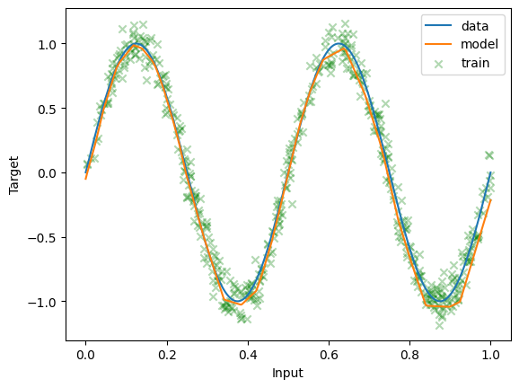
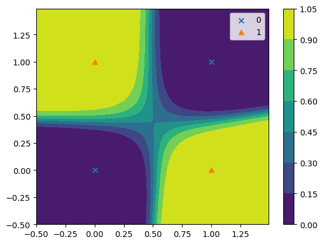

# Universal-function-approximators
This repo contains my experiments to see how Neural Networks can approximate any function from a given dataset.

---
## Approximating Sine function 

## Approximating XOR function

.gif)
